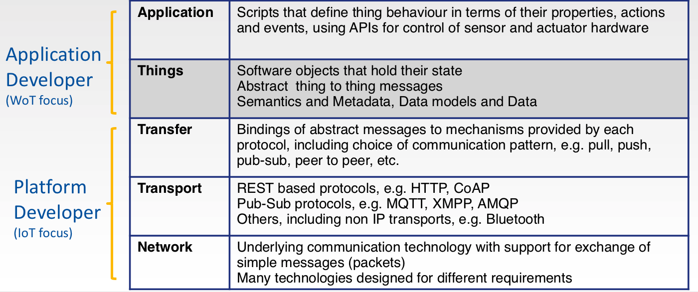

# Things in the Web of Things

The starting point for the Web of Things is the idea of things that stand for physical or abstract entities. For example, a temperature sensor in a weather station, a thermostat in a home, an entity denoting a collection of sensors, a person, a sporting event, a period of time and so forth. Some entities are connected to the network, but others (e.g. abstract entities) are not.

## Things as software objects exposed to applications

What makes things useful is the ability to associate them with data and services. Things are exposed to applications as software objects. For a physical entity, the actual sensor/actuator could be on a different machine, perhaps even on the other side of the World. In this sense things exist independently of the devices that host them. A given thing may be exposed to applications running on different devices. The software objects for a thing are synchronised by the platforms the applications are running on. A server script implements a thing in terms of the sensors and actuators it embodies. A client script interacts with a thing exported by a server script.

## Things as part of the Web of Linked Data

All things in the Web of Things are named with URIs as part of the W3C Resource Description Framework. This URI can be dereferenced to access the thing's description. The description includes the interaction model exposed to applications (what properties, actions and events it has), the semantic model describing what kind of a thing it is, links to other related things, and information that describes what protocols and communication patterns can be used to access a thing.

## Clients and Servers

The server script registers the thing with its URI on the platform it is running on. Client scripts running on another device can now register a proxy for that thing using its URI. The platform for the client script retrieves the thing description and creates the corresponding software object.  When either script updates a property of the thing, the platforms pass notifications to keep the software objects synchronised. This is illustrated in the following diagram:

Proxies can be chained as needed. A common scenario is where a thing is created by a battery operated device that is connected via a wireless protocol to a local gateway. This gateway is in turn connected to a cloud based server. That server is used by a web page that provides the human machine interface for the associated service. This scenario involves chained proxies in the gateway, cloud server and web page. Proxy chains are actually trees since a given thing/proxy may have more than one proxy registered for it.

## Simple application development

Applications are decoupled from the underlying protocols and communication patterns which can be chosen to fulfil the detailed requirements for particular services, and which will vary considerably from one application domain to another. Platform developers are responsible for implementation of the communication patterns and protocol bindings. The application designer can provide metadata to indicate choices. This is needed to enable one platform to know what communication pattern to use with another platform.

This is made possible through rich metadata that describes the data and interaction models exposed to applications and the information needed for platforms to interoperate. This includes the details for how the application data model maps to a particular protocol, the specific security requirements, and the semantic description of things to ensure that platforms are using the same meaning for a thing when they exchange its data.

## Abstract Messages and Communication Patterns

When an application updates a property of a thing, this change needs to be propagated to other instances of that thing. This can be modelled in terms of an abstract message that is passed along the proxy chain. A variety of other messages are needed to support actions, events etc. The mapping from abstract messages to concrete protocols varies from one protocol to the next, and depends on the communication patterns involved, e.g. push, pull, peer to peer, pub-sub and so forth. In some cases, this may involve buffering data for efficient transfer. Likewise, data from a set of sensors may be multiplexed into the same message.

## Further reading

* [proposal for the type system for things](./types.md).
* [mapping from abstract messages to specific protocols](./abstract-msgs.md)
* [proposal for representing things in JSON](./json-td.md)
* [application platforms for the Web of Things](./app-platforms.md)

